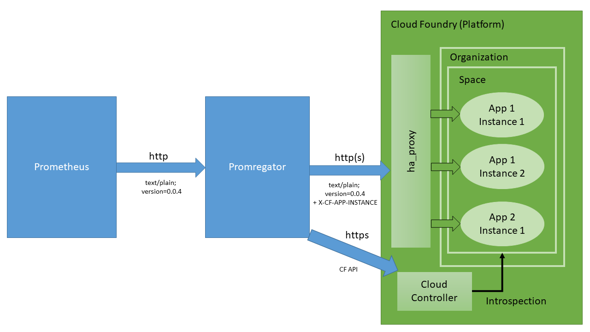

<p style="font-size:large">Statement on <a href="https://github.com/promregator/promregator/wiki/Statement-on-Promregator-and-CVE-2021-44228">CVE-2021-44228</a>!</p>


# Status

[](https://lgtm.com/projects/g/promregator/promregator/alerts/) [](https://lgtm.com/projects/g/promregator/promregator/context:java)

[](https://sonarcloud.io/dashboard?id=promregator) [](https://sonarcloud.io/dashboard?id=promregator) [](https://sonarcloud.io/dashboard?id=promregator) [](https://sonarcloud.io/dashboard?id=promregator) [](https://sonarcloud.io/dashboard?id=promregator)

# Promregator Project


The term "Promregator" is an artifical composite of the two terms "Prometheus" and "aggregator".

Prometheus is referring to the [Prometheus project](https://prometheus.io/), which is a toolset intended for retrieving telemetry data of running applications. It supports monitoring these metrics and triggering alerts based on thresholds.

Aggregator is referring to the aggregator concept, which you encounter several times in the Platform-as-a-Service offering of Cloud Foundry. 
The most prominent case of an aggregator in Cloud Foundry most likely is the [Loggregator](https://docs.cloudfoundry.org/loggregator/architecture.html).

The Promregator project intends to provide an aggregator-like tool for the Cloud Foundry environment, which allows fetching 
Prometheus metrics of a set of *Cloud Foundry app instances*. Note that it is not the intention to facilitate scraping of
metrics *on platform level* (e.g. for monitoring services, which are exposed via BOSH containers on the Cloud Foundry platform), but support monitoring of metrics *on application level* (if you are looking for platform monitoring, you might find https://github.com/pivotal-cf/prometheus-on-PCF and https://github.com/bosh-prometheus/prometheus-boshrelease interesting).

## Quickstart

If you want to jumpstart and see what Promregator may do, please refer to our [quickstart description](docs/quickstart-docker.md).

## Feature List

Here is the list of major features provided by Promregator:

* Standard Java-Application implemented using the Spring Framework. There is **no need for administrative privileges on your Cloud Foundry** installation!
  You can even run Promregator **outside of your Cloud Foundry environment** (such as behind an internal firewall), as Promregator also supports proxy servers.
* **Automatic discovery** of instances and hostnames of Cloud Foundry apps supported
  * **Multiple CF apps** in **multiple Orgs** and **multiple spaces** supported
  * **Multiple instances** per app supported, **automatically detecting up- and downscaling** (results are cached, timeout of caching can be configured)
  * *(>= 0.4.0)* **Auto-detection of all applications** within a CF space allows a simplified configuration
  * *(>= 0.4.0)* **Filtering of applications** within a CF space based on **Regular Expression** allows a simplified configuration
  * *(>= 0.5.0)* **Filtering of spaces** based on **Regular Expression** permits selection of multiple applications even if they are distributed over several spaces.
  * *(>= 0.5.0)* **Filtering of organizations** based on **Regular Expression** permits selection of multiple applications even if they are distributed over several organizations.
  * *(>= 0.5.0)* **Auto-detection of all applications** across all organizations and spaces allows a simplified configuration.
  * *(>= 0.5.0)* **Filtering of applications** across all organizations and spaces based on **Regular Expression** allows a simplified configuration.
  * *(>= 0.6.0)* **Selecting the route** to be used for scraping can be controlled by providing **Regular Expressions**.
* Fetching of the **Prometheus Metric endpoints** of multiple app instances is performed in **parallel** (number of concurrent threads used for retrieving metrics can be configured).
* **Support of Authentication Schemes** at the CF app's endpoint. The following Authentication schemes are currently available:
  - Basic HTTP Authentication (as of [RFC2617](https://www.ietf.org/rfc/rfc2617.txt))
  - [JWT](https://jwt.io/)-based authentication (with retrieval of JWT from [OAuth2](https://oauth.net/2/) server, JWT is cached), (since *>= 0.10.0* both support for basic authentication against the OAuth2 authentication server and certificate-based authentication)
  - Null Authentication (not recommended for productive environments!)
  
  The available authentication schemes are easily extensible.
  
  *(>= 0.4.0)* Each target may be configured to use its own authentication scheme, thus you may authenticate to multiple CF apps using different credentials.
  *(>= 0.9.0)* Ability to specify the [SSL Context](docs/mtls-ssl-contexts.md) used by promregator using JVM options
* *(>= 0.2.0)* **Support for inbound authentication** (e.g. Prometheus authenticates to Promregator) using Basic HTTP Authentication. 
* **Configuration using standard Spring properties** as defined by the Spring Framework (e.g. using `application.yml` file).
* *(>= 0.6.0)* Support for [**encrypted passwords in configuration files**](./docs/passwords-in-config.md) including providing the encryption key via **Docker Secrets**
* Simple **HTTP proxy support** is available for contacting CF app endpoints.
* All metrics provided from the Cloud Foundry applications are **automatically [enriched with additional labels](docs/enrichment.md)**, indicating their origin (similar to the `job` and `instance` labels [created by Prometheus](https://prometheus.io/docs/concepts/jobs_instances/)).
* [Additional metrics are provided](docs/enrichment.md) supporting you to **monitor Promregator** and the **communication to the Cloud Foundry applications**.
* *(>= 0.4.0)* **[Cache Invalidation](docs/invalidate-cache.md)** is possible via an (optionally auth-protected) HTTP REST endpoint.
* Promregator's endpoints (e.g. `/metrics`, `/promregatorMetrics`, `/discovery`) support **GZIP compression**, if the clients indicates to accept it.
* *(>= 0.9.0)* [Filtering by annotations](docs/annotation-driven.md) and using annotations to specify the metrics path.


## Architecture


Promregator is sitting between your Prometheus server on the one hand and talks to your Cloud Foundry apps on the other hand. 
It is converting the Prometheus' scraping requests into queries targeting your instances of your apps, which are running on Cloud Foundry. 

For further details on the architecture of Promregator, please look at the [architecture page](docs/architecture.md).

During the course of action, we came across several other implementation alternatives. Due to one or the other reason they were not implemented. You may find a detailed discussion about these approaches on our [discarded ideas page](docs/discarded-ideas.md).

## Prerequisites

Running Promregator requires:
* JRE8 or higher

Compiling Promregator additionally requires:
* JDK8 or higher
* Maven 3.3.0 or higher

Further dependencies required are automatically loaded when building the software. An internet connection to [Maven Central](https://search.maven.org/) is necessary for that.

## Installation

Promregator has been [released first](https://github.com/promregator/promregator/releases/tag/v0.1.0) on 2018-03-18. It currently provides two binary-based deliveries:

* You may download versions of the released jar file at [https://github.com/promregator/promregator/releases](https://github.com/promregator/promregator/releases).
* You may use the prepared Docker container which is available at [https://hub.docker.com/r/promregator/promregator/](https://hub.docker.com/r/promregator/promregator/). Hints on suggested parameters can be found at [this page](docs/docker-start.md).

Furthermore, you may create your own package by downloading the source code, unpacking it into a local folder and calling

```bash
mvn clean package
```

The runnable artifact will be available at `target/promregator-*-SNAPSHOT.jar`. It is a self-contained (e.g. including all library dependencies) JAR file, which can be copied around and executed at an arbitrary folder by calling

```bash
java -jar promregator-x.y.z-SNAPSHOT.jar
```

## Documentation

A detailed documentation, including a description how you may configure Promregator, what needs to be done to integrate it with Prometheus is available at the [documentation pages](docs/documentation.md).


## Related Work / References
For related work, which we came across, refer to our [references page](docs/references.md).

## Sending Analysis Material

For sending material (e.g. memory dumps) for analysis, which you do not want to (or even should not) share to/with the public, please refer to our [analysis material page](docs/analysis-material.md)

